# 🎮 CraftManager

> **The Ultimate Minecraft Content Manager for Windows & Android**  
> Manage your addons, mods, shaders, packs & worlds — all in one place. Download anything you want from the built-in Online Mods Hub. ⚡

---

### 🌐 Online Mods Hub
* **Search Everything** — Mods, shaders, maps, packs & more.
* **Trusted Sources** — CurseForge, Modrinth, MCPEDL & 9Minecraft.
* **Smart Filters** — Powerful Java / Bedrock content separation.
* **Any Version You Want** — Old releases & mirror links included.

---

## 💻 Platforms & Features Overview

| 🖥️ Windows (PC) | 📱 Android (Mobile) |
| :--- | :--- |
| **🟢 Bedrock Edition** • **Addon Manager** — Install & manage addons with trusted sources (MCPEDL, CurseForge & 9Minecraft), resource packs & behavior packs in one click. • **Skin Packs** — Full support for custom skin packs. • **World Manager** — Export, backup & manage your worlds safely. | **📱 Mobile Version** • **Addon Manager** — Manage your resource and behavior packs on the go. • **Shop Hub** — Browse and download add-ons, maps, and texture packs directly from your phone. • **Optimized UI** — Designed specifically for smooth mobile navigation. |
| **🔵 Java Edition** • **Mods** — Install any `.jar` straight into your `.minecraft` folder. • **Shaders & Resource Packs** — One-click installation. • **Version Picker** — Pick any release & mod loader (*Fabric / Forge / NeoForge / Quilt*). • **Modpacks** — Full `.mrpack` support. | *Portable and lightweight experience built specifically for mobile devices.* |

---

## 🖼️ App Screenshots

### 🖥️ Windows (PC) Showcase

  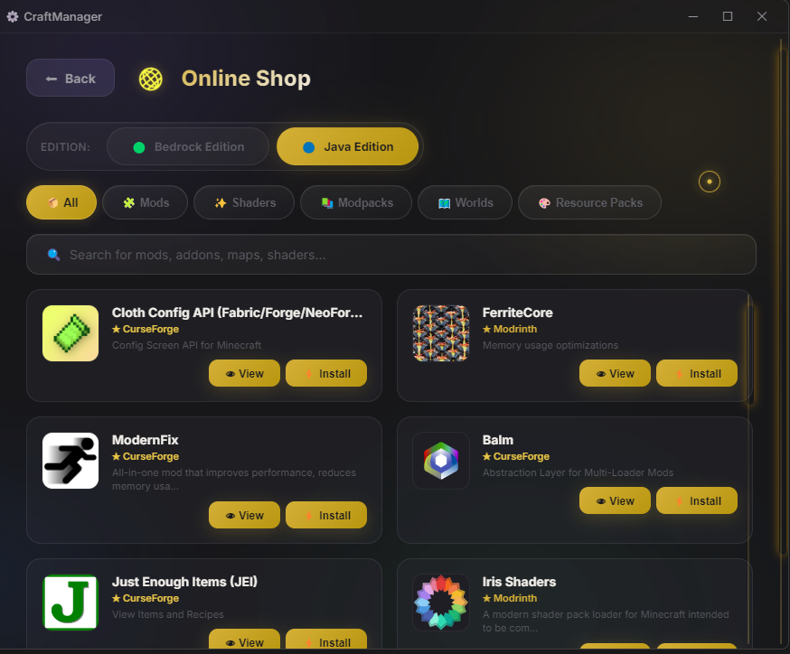
  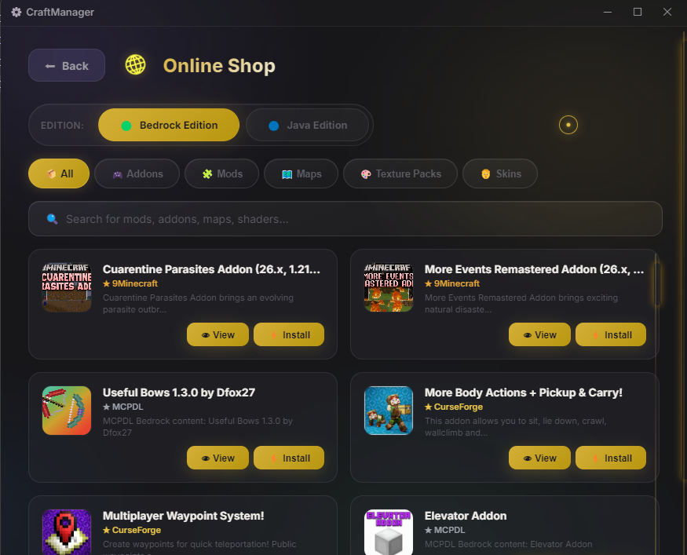

  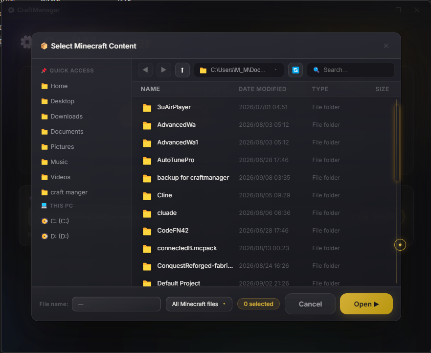
  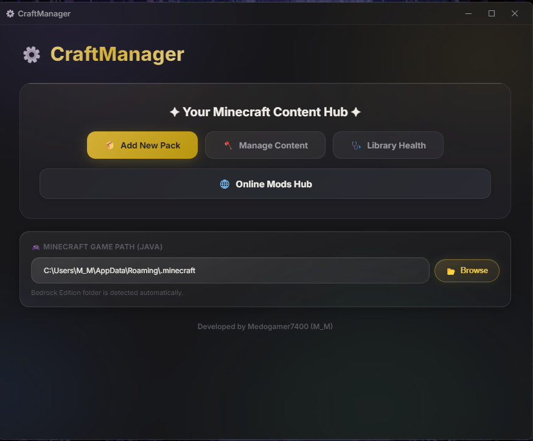

  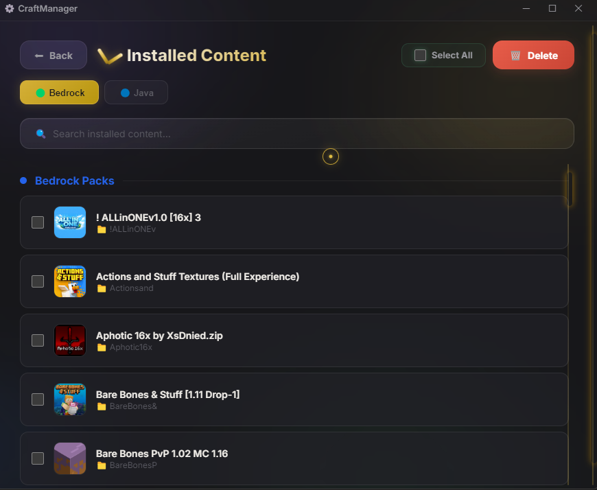
  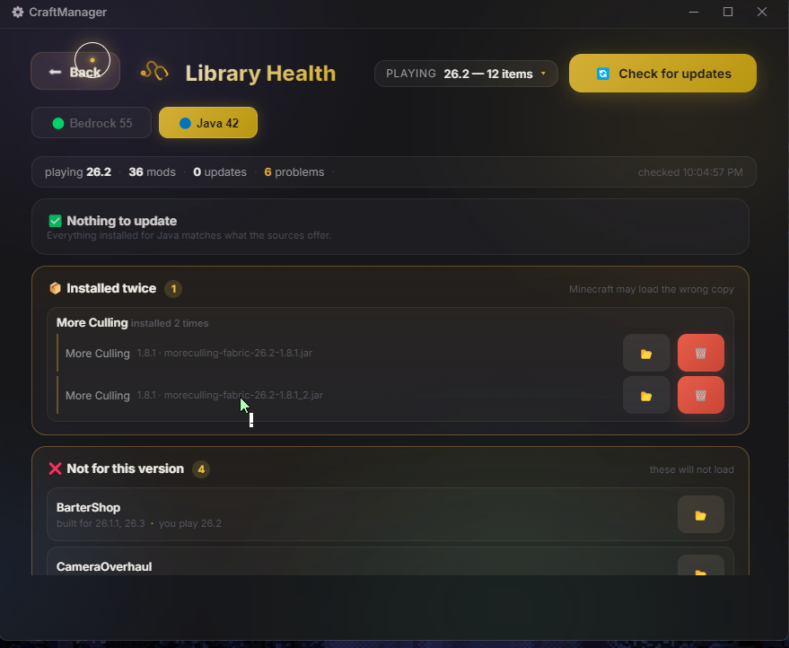

  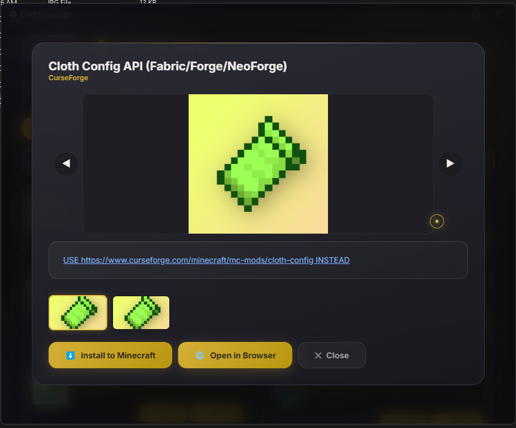
  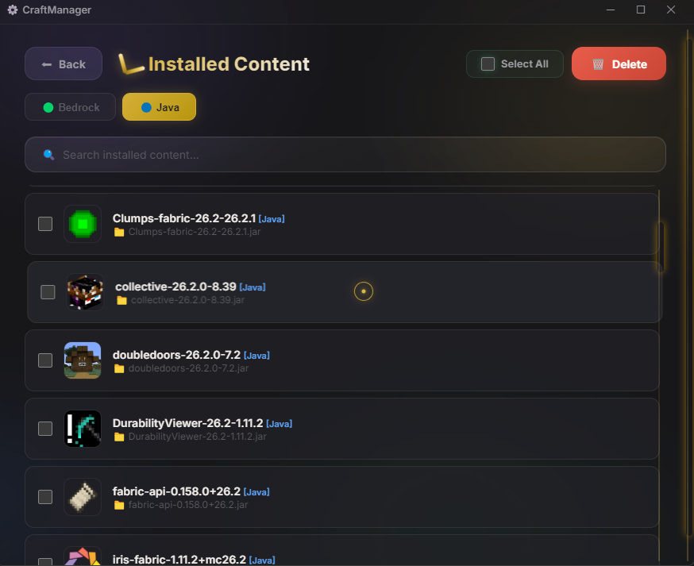

  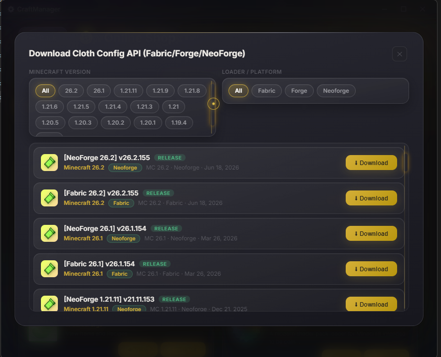

### 📱 Android (Mobile) Showcase

  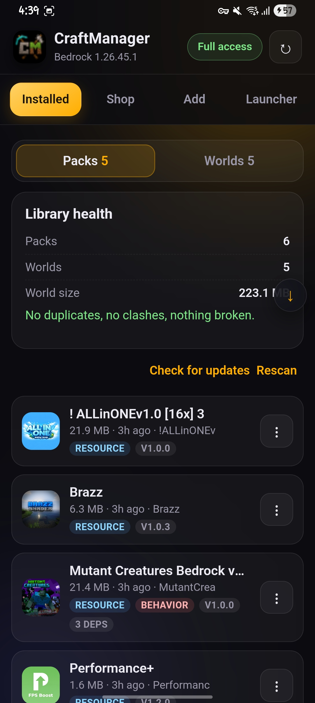
  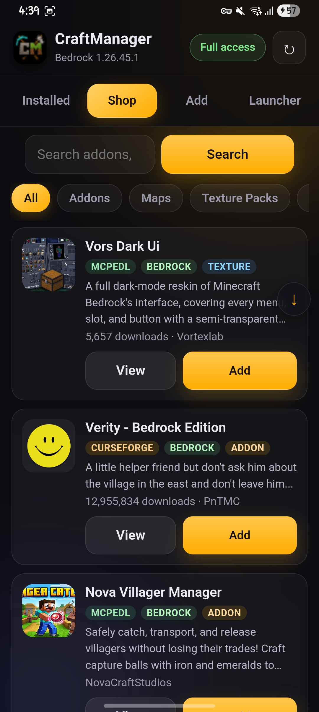
  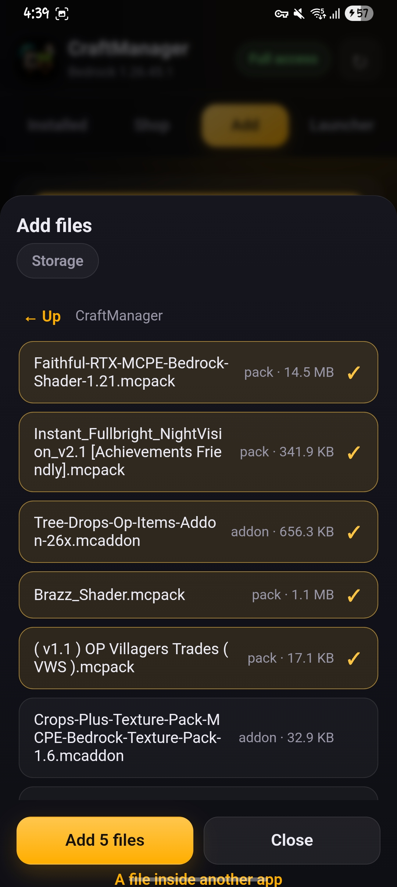

  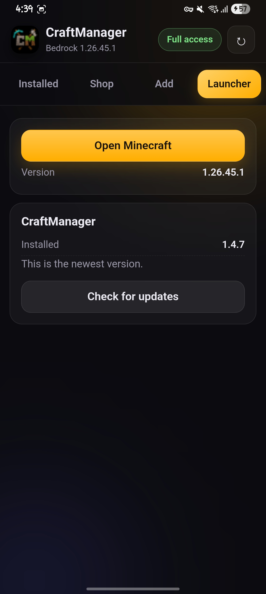

---

## 📥 Installation & Usage

| 🖥️ Windows (PC) | 📱 Android (Mobile) |
| :--- | :--- |
| 1. **Download** the latest release (`CraftManagerSetup.exe`) from the **Releases** section. 2. **Run** it — CraftManager replaces any older version automatically. 3. **Open** CraftManager and enjoy! ✨  > 📌 **Note:** If you have a version **older than v1.4.3**, please uninstall it manually first. > On **v1.4.3 or newer** — no need to uninstall, just run the new installer and you're done. ✅ | 1. **Download** the latest APK (`CraftManager-Android-vX.X.X.apk`) from the **Releases** section. 2. **Install** the APK on your Android device. 3. **Open** CraftManager and enjoy your mobile content management! ✨ |

---

## 📦 Supported Content (PC)

| 🟢 Bedrock | 🔵 Java |
| :--- | :--- |
| 🔘 Addons (`.mcaddon`) | 🔘 Mods (`.jar`) |
| 🔘 Resource Packs (`.mcpack`) | 🔘 Shaders |
| 🔘 Behavior Packs | 🔘 Resource Packs |
| 🔘 Worlds (`.mcworld`) | 🔘 Modpacks (`.mrpack`) |
| 🔘 Skin Packs | 🔘 Worlds |

---

  <i>🧡 CraftManager makes managing Minecraft content simple, fast, and organized across PC and Android.</i>

